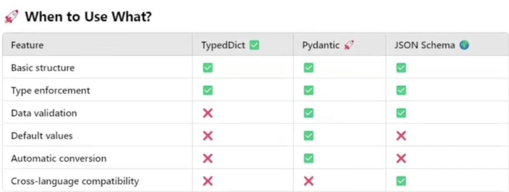

# 🔎 Langchain-Structured-Outputs

This repository captures my practical learning journey on using **structured outputs** in Langchain. I explored how to define and enforce structured formats using schema-based approaches while interacting with LLMs for consistent, JSON-style outputs.

---

## 🚀 What I Explored

- **TypedDict**  
  Learnt how to create simple schemas for structured responses using Python's built-in `TypedDict`.

- **Pydantic**  
  Used `BaseModel` to add validation, constraints, and default values to LLM outputs.

- **JSON Schema**  
  Understood how Langchain internally leverages JSON schema (especially via Pydantic) for LLM output formatting.

- **`with_structured_output()`**  
  Implemented this method to instruct the model to return structured responses with a defined schema.

- **LangChain + HuggingFace**  
  Worked with HuggingFace models and APIs to implement structured outputs from open-source LLMs like `Mixtral`, `Zephyr`, and others.

- **Real-World Examples**  
  Created review analysis systems extracting sentiment, summary, key themes, pros/cons, and more — all returned in a structured format.

---

## 🧱 Structure

The repository is divided into:

- `test.py` – used to verify that Langchain and its dependencies are set up correctly
- `typed_dict_demo.py` – Using TypedDict for defining simple key-type pairs
- `pydantic_demo.py` – Using Pydantic to create robust schemas
- `json_schema.json` – json schema demo
- `with_structured_output_typeddict.py` – Langchain + TypedDict based output
- `with_structured_output_pydantic.py` – Langchain + Pydantic based output
- `with_structured_output_json.py` – Langchain using JSON Schema 

---

## 📌 When to Use What

 
(A visual comparison of TypedDict, Pydantic, and JSON schema based on use cases.)

---

## 🛠 Setup

1. Clone the repository  
2. Add your `.env` file with the HuggingFace API key  
3. Install dependencies:
   ```bash
   pip install -r requirements.txt

---

## 🤝 Author

**Nipun Kumar**  
[Portfolio](https://nipun.framer.website/) • [GitHub](https://github.com/nipunraj96) • [LinkedIn](https://www.linkedin.com/in/nipunkumar01)
